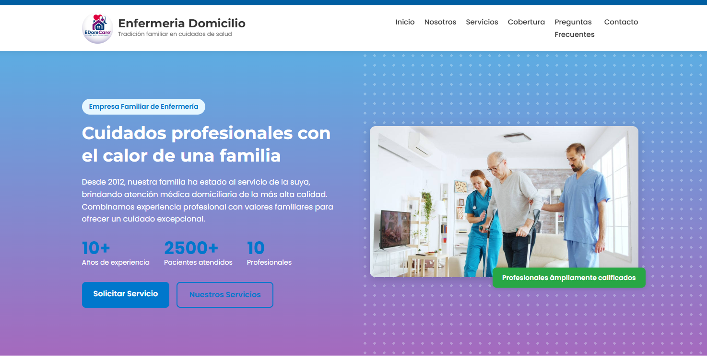
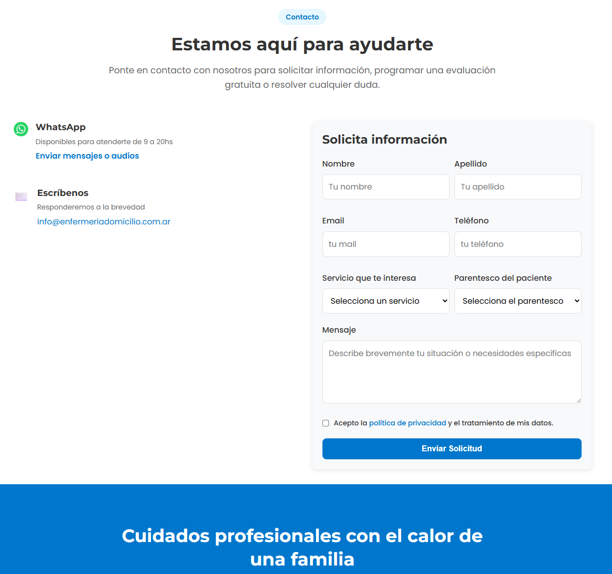

# 🏥 Sitio Web de Enfermería Domiciliaria

Sitio web profesional desarrollado para promocionar servicios de enfermería domiciliaria en Argentina.  
Pensado para brindar confianza, información clara y una vía de contacto directa para los pacientes y sus familiares.

---

## 🌐 Demo online

📎 https://realwise15.github.io/enfermeria-domicilio/

---

## 🧩 Secciones del sitio

- **Inicio:** Presentación clara de los servicios ofrecidos
- **Nosotros:** Experiencia, valores y equipo
- **Servicios:** Detalle de prácticas disponibles
- **Contacto:** Formulario para solicitar turnos o consultas
- **Políticas de privacidad y legales**

---

## 🎯 Objetivos del proyecto

- Ofrecer una presencia profesional online para servicios de salud domiciliarios
- Facilitar el contacto con pacientes
- Brindar una imagen confiable, clara y accesible en todos los dispositivos

---

## 🛠️ Tecnologías utilizadas

- **Frontend:** HTML5, CSS3, JavaScript
- **Diseño responsive:** Adaptado a celulares y tablets
- **Formularios:** PHP
- **Base de datos:** MySQL
- **Hosting:** DonWeb y GitHub Pages

---

## 📸 Capturas

### 🖼️ Página de inicio

### 📩 Página de contacto

---

## 👨‍💻 Autor

**Miguel Ángel Quisbert Flores**  
📍 Buenos Aires, Argentina  
📧 quisbert.flores.miguel@gmail.com  
📞 11-3562-5231

---

## 📄 Licencia

Este proyecto es de uso personal. Prohibida su reproducción sin autorización del autor.
"""
